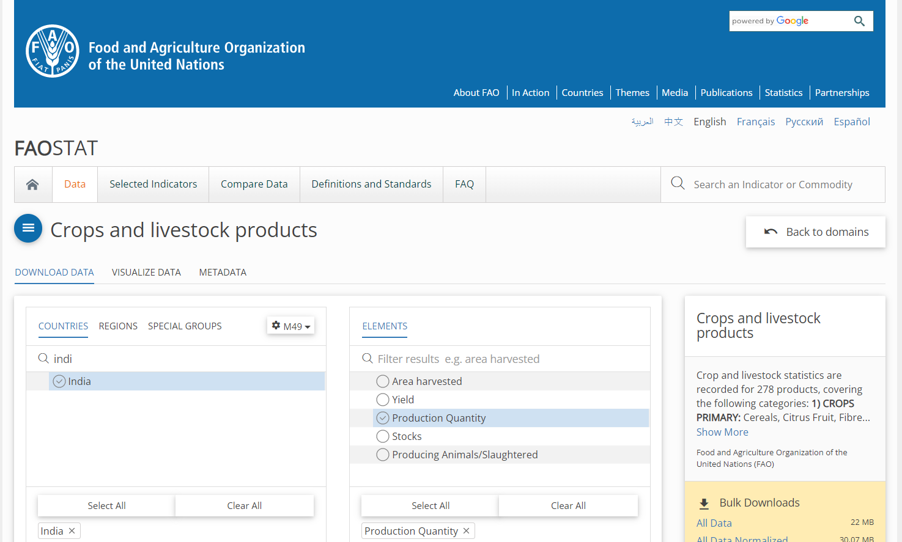
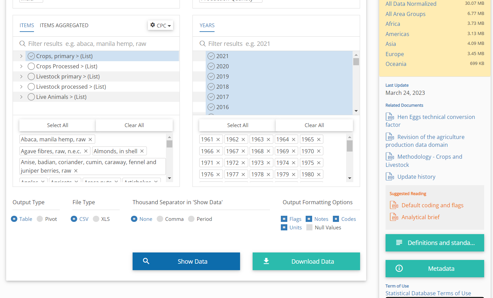
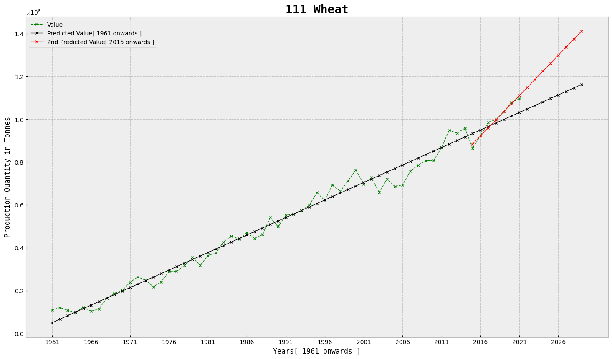

# Crop-production-prediction

It's pretty simple to use and navigate the repository, the dataset was downloaded from the [FAO](https://www.fao.org/faostat/en/#data/QCL) website, for more information about it, you can visit https://www.fao.org/home/en.

The first file that I used was `cleaning_and_splitting.ipynb`, used to remove some redundant columns and then seperate data according to items. They were then saved in the folder labelled `All datasets` which should contain 84 files for 84 different items which are primary crops differentiated according to CPC codes.

The next file `model_fitting.ipynb` uses the individual datasets for some preliminary data analysis containing various pictorial representations as well. I have used the `111___Wheat.csv` dataset as Wheat is part of the staple diet in India and is a major agricultural product too.

Feel free to clone the repository and play around with the other datasets.
For dependencies, I used a few Python libraries which can be downloaded from `pip`, namely;
- `numpy`
- `scikit-learn`
- `pandas`
- `matplotlib`

The code is definitely not optimized and I would request guidance from anyone willing to provide it, they can do so by opening a PullRequest with the appropriate changes.

Thank you for viewing!!
